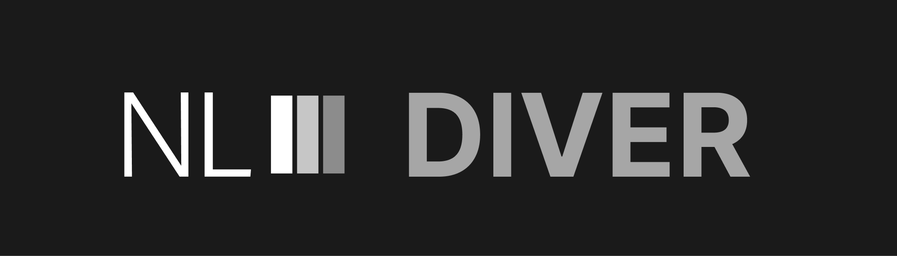
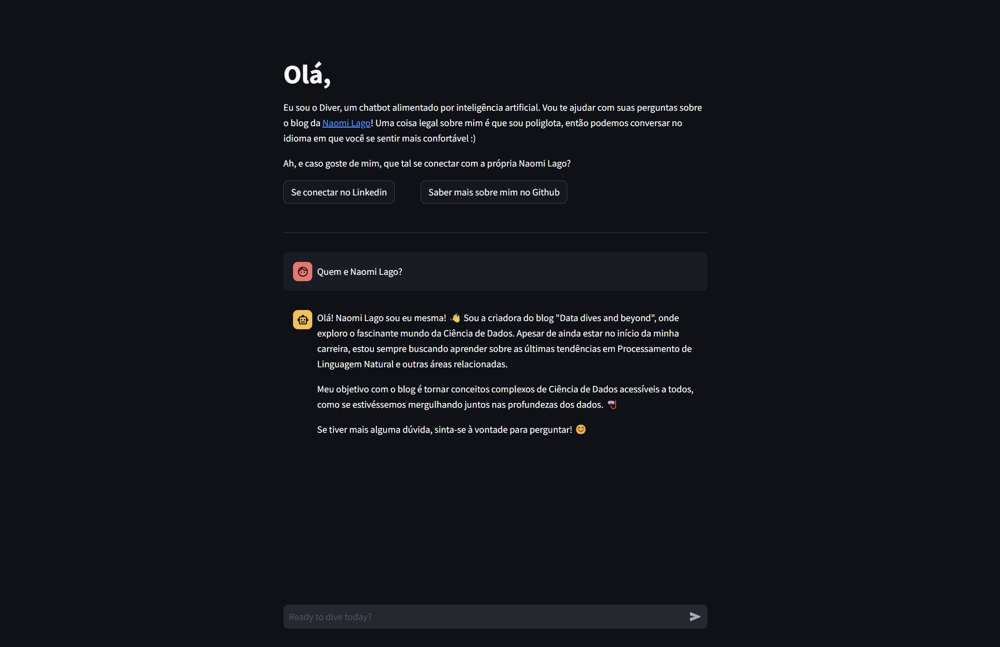
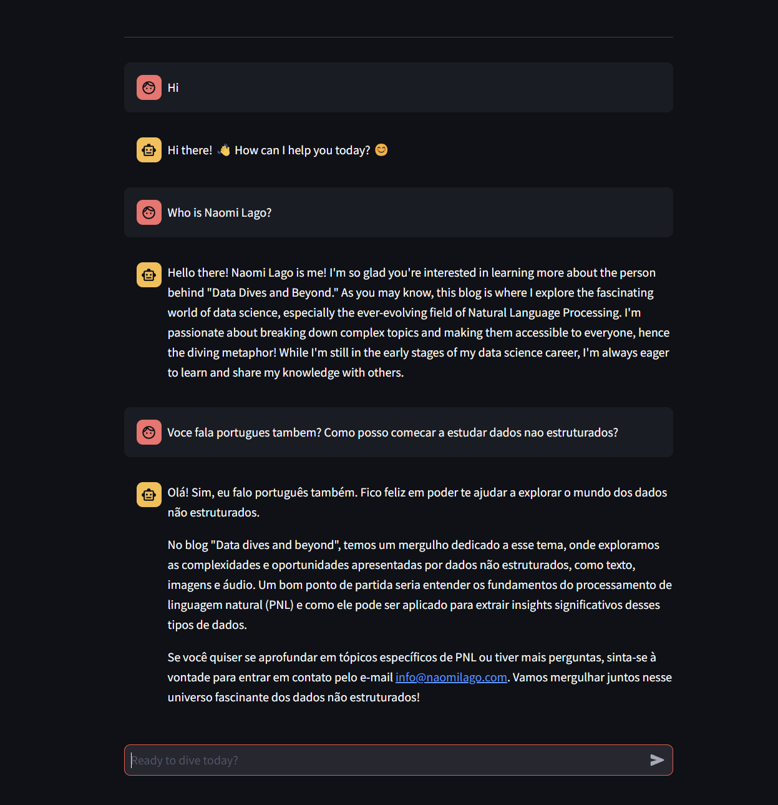
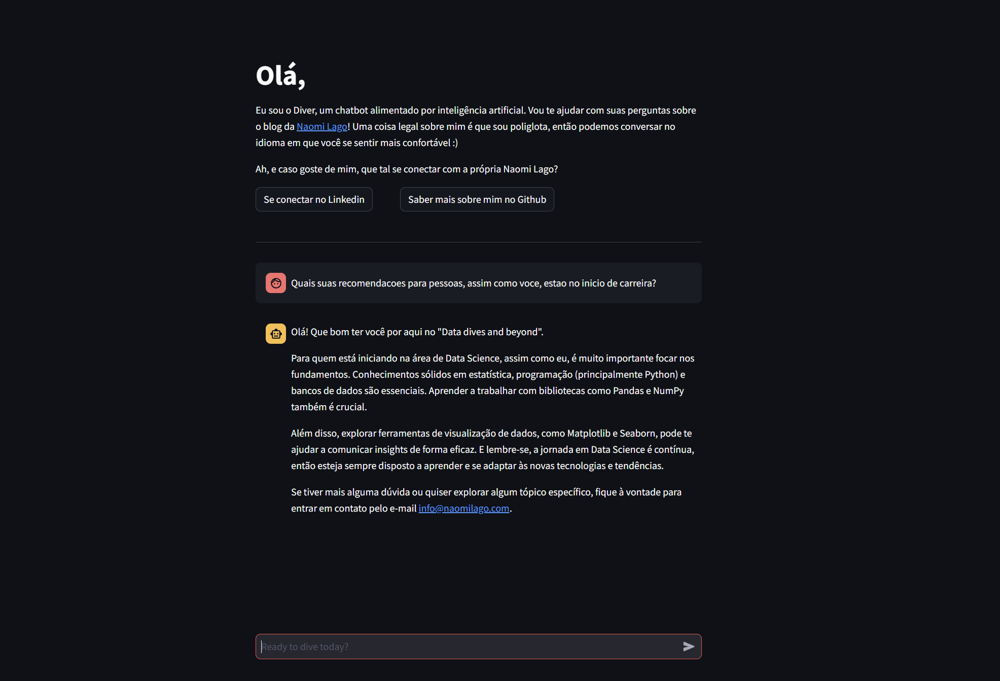

<br>

# Welcome to Diver!

<br>

<p align='justify'>&nbsp;&nbsp;&nbsp;This is an AI-powered chatbot that helps you navigate my tech blog https://naomilago.com. It can answer questions about my blog posts, my technology skills, and my projects. It can also help you find relevant questions about my own technology skills, by explaining complex concepts in simple terms and also in a friendly manner.</p>

> The most important thing is that this project is part of the Imersão IA, a project created by [Alura](https://www.alura.com.br/) and [Google](https://google.com), a Brazilian online learning platform. The goal of this project is to help people learn how to get the most out of AI and explore Gemini's powerhouse.

<br>

## Authorship

- [@naomilago](https://www.github.com/naomilago)
<p align='justify'>&nbsp;&nbsp;&nbsp;A curious Data Scientist who always like to explore new technology and is passionate about NLP, starting to dive into RAG systems now in 2024.</p>

<br>

## FAQ

#### What technologies were used?

- Diver was built using foundational tools, such as the [Gemini](https://aistudio.google.com/) model, [LangChain](https://langchain.com/), [HuggingFace](https://huggingface.co/), [ChromaDB](https://www.trychroma.com/), and [Streamlit](https://streamlit.io/).

#### Can I trust this chatbot responses for complex questions?

- Well, as any RAG system, Diver is not perfect. The vector store used for retrieval is based on the current content within my blog, and the chatbot will always provide you with the best answer possible - including suggesting my contact if the answer is beyonde its knowledge.

#### What languages does it support?

- The Diver's core components includes Gemini, a multilingual model, so it can understand and answer questions in multiple languages - including English, Portuguese, Spanish, and many others.

<br>

## Screenshots





<br>

## Run Locally

<p align='justify'>&nbsp;&nbsp;&nbsp;You can also run Diver locally! If you'd like to explore, just follow these steps and have fun :)</p>

Clone the project

```bash
  git clone https://github.com/naomilago/diver.git
```

Go to the project directory

```bash
  cd diver
```

Install dependencies

```bash
  pip install -r requirements.txt
```

Create a `/config/.secrets.json` file with the following content:

```json
  {
    "HF_TOKEN": "<YOUR-HUGGING-FACE-TOKEN>",
    "GEMINI_API_KEY": "<YOUR-GEMINI-API-KEY>",
    "LANGSMITH_API_KEY": "<YOUR-LANGSMITH-API-KEY>"
  }
```

Start the server

```bash
  python -m streamlit run src/app.py
```